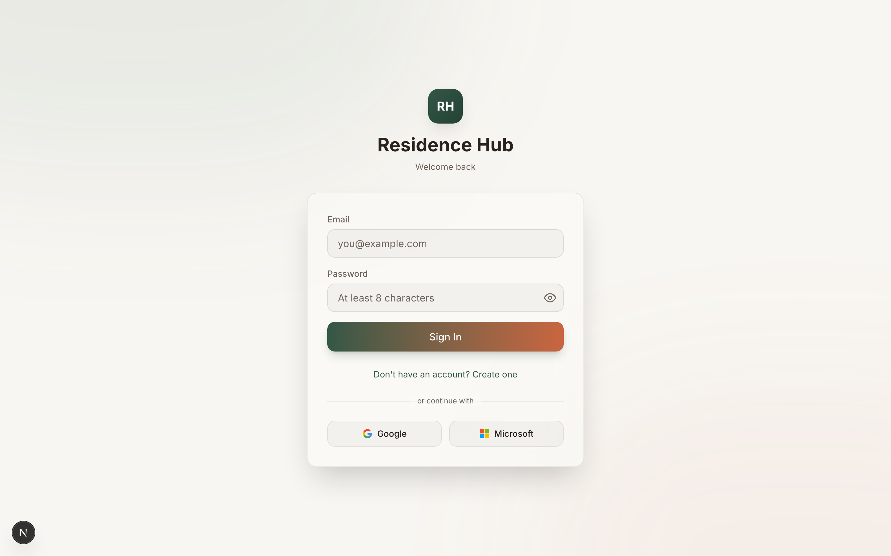
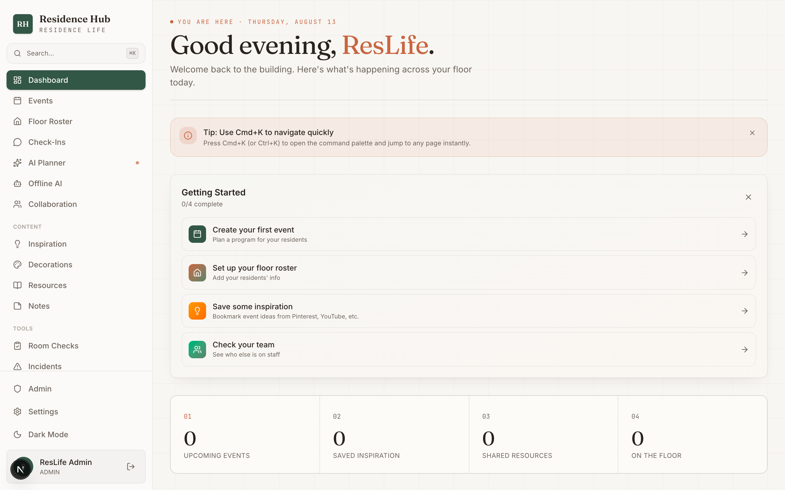
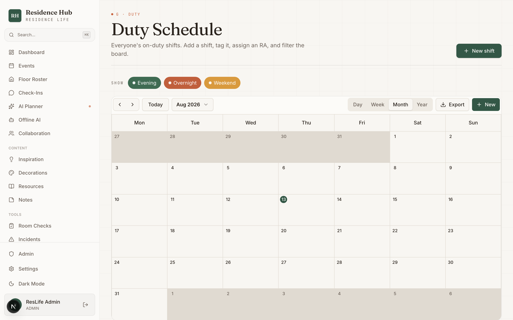

# 🏠 Residence Hub

**An all-in-one operations platform for student Resident Assistants (RAs) and residence-life staff.**


Residence Hub replaces the scattered spreadsheets, group chats, and paper forms RAs juggle — floor rosters, 1:1 check-ins, health-&-safety room checks, duty schedules, event planning, incident reporting, and shared resources — with one warm, fast web app.

🔗 **Live:** [jerichoreshub.dpdns.org](https://jerichoreshub.dpdns.org)

> New to the codebase? Read the deep-dive **[Developer Guide](docs/CODEBASE_GUIDE.md)** (architecture, data model, API reference, deployment runbook).

## 📸 Screenshots

| Sign in | Dashboard |
|---|---|
|  |  |

**Duty schedule** — shared on-duty calendar with type filters and per-shift editing:



---

## ✨ Features

- **Floor Roster** — a room-by-room resident directory. RAs manage their own residents; admins see everyone. Inline add/edit with structured floor/wing.
- **1:1 Check-Ins** — private per-RA conversation logs (mood, topics, notes, follow-up). Organize them into **boards/campaigns** (admin-created *shared* boards, or personal boards). Duplicate-safe: one check-in per resident per day (or once per shared campaign).
- **Room Checks** — health-&-safety inspections against **admin-created boards**. RAs mark their residents **Pass/Fail** with a note; checked residents drop off the pending list into "Done," with edit/undo to fix mistakes. Filter by RA/floor/wing.
- **Events & Calendar** — post programs with categories, colour tags, recurrence, and locations; month/list calendar views; event templates.
- **Duty Schedule** — a shared on-duty calendar (Ilamy). Create shifts with a title, type (evening/overnight/weekend), assigned RA, tag, and repeat; click a shift to edit; filter the board.
- **Collaboration Boards** — kanban planning boards. Everyone views; the creator, added **collaborators**, or admins can add/edit/move/delete tasks and edit the board.
- **Decorations** — a craft catalog (door decs, bulletin boards) with materials, per-item "where to buy" links, an auto-summed cost estimate, and a source/tutorial link. Admins can import a built-in campus-resource set.
- **Resources** — shared links/files with an **admin approval flow** (RA submissions stay pending until approved).
- **Inspiration** — a pinboard for programming ideas with live link previews.
- **Incidents** — a front-desk incident log (severity, status, follow-up, public/private) with **admin-editable "reporting tracks" and "campus resources"** reference sections.
- **Notes** — quick sticky notes.
- **Notifications** — an **in-app** alert feed: duty reminders, weekly "residents overdue for check-in" digests, and resource approvals.
- **AI Planner** — event-idea generation with multi-provider fallback, plus an **offline, in-browser AI** chat (WebLLM on WebGPU, wllama on CPU/Firefox) that runs 100% on-device.
- **Admin** — issue registration codes (RA / Administrator), and a one-click database schema repair.

---

## 🧱 Tech stack

| Layer | Choice |
|---|---|
| Framework | Next.js 15 (App Router) + React + TypeScript |
| Styling | Tailwind CSS + a small custom "wayfinding" design system |
| ORM | Prisma 6 |
| Database | SQLite locally · **Turso (libSQL)** in production |
| Auth | NextAuth (Credentials + Google + Azure AD), JWT sessions |
| Calendar | `@ilamy/calendar` |
| On-device AI | `@mlc-ai/web-llm` (WebGPU) + `@wllama/wllama` (CPU/WASM) |
| Hosting | Vercel (+ Vercel Cron) |
| Testing | Playwright (E2E) + Vitest |

---

## 🚀 Getting started (local)

**Prerequisites:** Node.js 20+, npm.

```bash
# 1. install
npm install

# 2. create your local env
cp .env.example .env          # then fill in the values below

# 3. create the local SQLite database
DATABASE_URL="file:./dev.db" npx prisma db push

# 4. (optional) seed a starter admin + authorization codes
npm run db:seed               # prints a generated admin password + codes,
                              # or set SEED_ADMIN_PASSWORD / SEED_RA_CODE /
                              # SEED_ADMIN_CODE in .env to pin them

# 5. run it
npm run dev                   # http://localhost:3000
```

Sign in with the seeded admin (`SEED_ADMIN_EMAIL`, default `admin@residencehub.com`) using the password the seed printed, or register a new account using an authorization code created from the **Admin** page.

### Environment variables

Minimum for local dev: `DATABASE_URL`, `NEXTAUTH_URL`, `NEXTAUTH_SECRET`. The rest enable optional features.

| Variable | Purpose |
|---|---|
| `DATABASE_URL` | Local SQLite path, e.g. `file:./dev.db` |
| `NEXTAUTH_URL` | Base URL (`http://localhost:3000` locally) |
| `NEXTAUTH_SECRET` | Session encryption — `openssl rand -base64 32` |
| `TURSO_DATABASE_URL` / `TURSO_AUTH_TOKEN` | Production DB (Turso); omit locally |
| `GOOGLE_CLIENT_ID` / `GOOGLE_CLIENT_SECRET` | Google sign-in (optional) |
| `AZURE_AD_CLIENT_ID` / `_SECRET` / `_TENANT_ID` | Microsoft sign-in (optional) |
| `OPENROUTER_API_KEY` / `NVIDIA_API_KEY` / `GEMINI_API_KEY` | AI planner providers (optional) |
| `CRON_SECRET` | Protects the `/api/cron/*` endpoints on Vercel |

> Notifications are **in-app only** — there is no email/SMS integration to configure.

---

## 🧰 Scripts

```bash
npm run dev            # start the dev server
npm run build          # prisma generate → gen-schema-ts → sync-turso → next build
npm run lint           # ESLint
npm run test           # Vitest unit tests
npm run test:e2e       # Playwright end-to-end suite (uses a running/started dev server)
npm run db:studio      # Prisma Studio
npm run db:seed        # seed the admin user
```

Type-check without building: `npx tsc --noEmit --skipLibCheck`.

---

## 🗂️ Project structure

```
src/
  app/
    (app)/     # authenticated pages (dashboard, residents, check-ins, room-checks, …)
    (auth)/    # login / register
    api/       # REST route handlers (incl. /api/cron/*, /api/admin/*)
  components/  # ui primitives + wayfinding design system + TagPicker
  lib/         # prisma, auth, notify, boardAccess, utils, localai/, aiPlanner
prisma/
  schema.prisma  # source of truth
  schema.sql     # DDL mirror applied to Turso
scripts/         # sync-turso.mjs, gen-schema-ts.mjs
e2e/             # Playwright suite
docs/            # CODEBASE_GUIDE.md
```

---

## 🗄️ Database & the Turso sync (important)

Locally the app uses a SQLite file; **in production it uses Turso**. Because
`prisma db push` only touches the local file, schema changes reach Turso through a
committed `prisma/schema.sql`, applied at build (`scripts/sync-turso.mjs`) and available
at runtime for repair (`src/lib/turso-schema-sql.ts`, generated by `gen-schema-ts.mjs`).

**When shipping a schema change:** edit `schema.prisma` → `prisma db push` (and restart
`npm run dev`) → mirror the change into `prisma/schema.sql` → commit. On deploy the build
syncs Turso automatically.

**If prod shows "Failed to load/save" after a schema change** (columns missing in Turso),
sign in as admin and run in the browser console:

```js
fetch('/api/admin/repair-db', { method: 'POST' }).then(r => r.json()).then(console.log)
```

It idempotently creates any missing tables/columns. See the [Developer Guide](docs/CODEBASE_GUIDE.md#3-database--the-turso-sync-read-this) for the full runbook.

---

## 🚢 Deployment

Hosted on **Vercel** with a **Turso** database.

1. Merge to the production branch — Vercel builds with `npm run build` (runs the Turso sync).
2. Set the env vars above in the Vercel project (ensure `TURSO_*` are available to the **Build** step).
3. `vercel.json` also declares the cron schedules (duty reminders daily, check-in digest weekly).

---

## 🧪 Testing

`npm run test:e2e` runs the Playwright happy-path suite against a dev server (it reuses a
running one or starts its own), logging in once as the seeded admin and exercising the
core create/edit flows. Note: it writes real rows to the local DB (tagged `E2E-…`).

---

## 📖 Documentation

- **[Developer Guide](docs/CODEBASE_GUIDE.md)** — architecture, full data model, API
  reference, feature walkthroughs, and the deployment/runbook.
- `docs/` also holds the original design docs (schema, user flows, wireframes).

---

_Built for residence-life teams. Roles: **RESIDENT_ASSISTANT** (default) and **ADMIN**._
